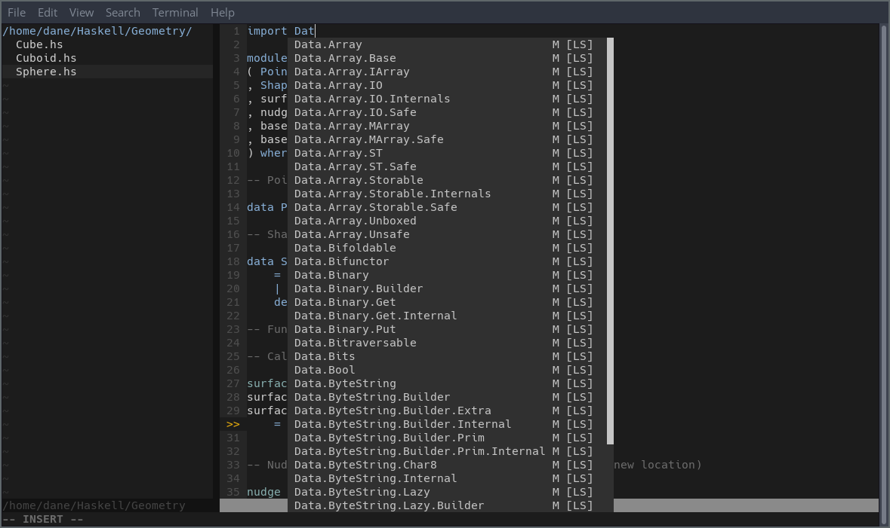
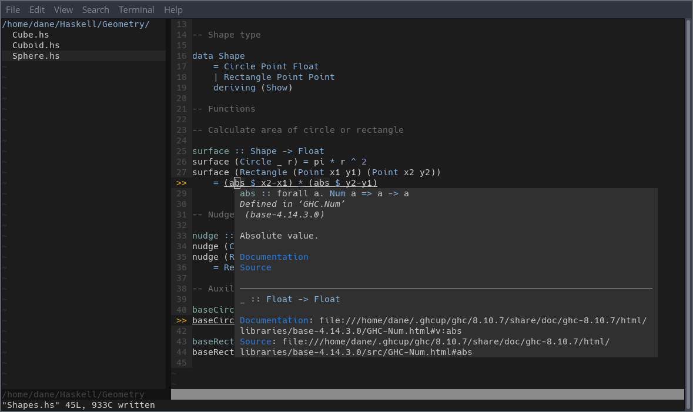
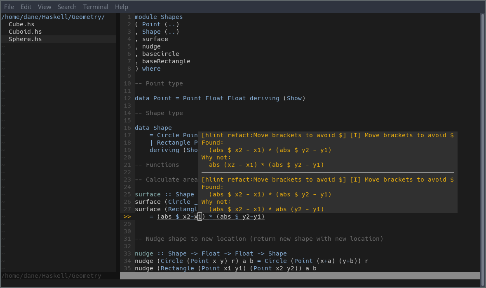

# Haskell IDE Installation

Scroll to the bottom for screenshots.

## Dependencies

### Haskell Toolchain

Install the Haskell toolchain via [GHCup](https://www.haskell.org/ghcup/) and follow the instructions to get GHC, Cabal, HLS and (optionally) Stack on your system.

Your Linux distribution's package manager may also have a package for installing HLS. For example, via pacman on Arch Linux:

``` bash
sudo pacman -S haskell-language-server
```

### Update PATH

It is necessary to update your PATH so the system knows where to find the `haskell-language-server-wrapper`, `ghc` and `ghci` binaries. The location to append to the PATH is `$HOME/.ghcup/bin`. For example, if you're using bash, open your `.basrc` file and add the following line:

```bash
export PATH="$PATH:$HOME/.ghcup/bin"
```

### Symbolic Links for ghc and ghci

Depending on your system, GHCup will install `ghc` and `ghci` binaries by appending its corresponding version to the binary name. For example, you may have binaries in `.ghcup/bin` such as `ghc-8.10.3` and `ghci-8.10.3`.

The coc.nvim plugin needs to find files called `ghc` and `ghci` without the version prefix. If you don't have these files in your `.ghcup/bin` folder, simply create the symbolic links with the `ln` command and link them to the Haskell compiler version you wish to work with:

```bash
cd ~/.ghcup/bin
ln -s ghc-8.10.3 ghc
ln -s ghci-8-10.3 ghci
```

Test that these links work by invoking the following commands:

```bash
ghc --version
ghci
```

### Other Dependencies

The coc.nvim plug-in requires Node.js 12.12+, so either update your installation or install it from scratch using your package manager or via curl:

```bash
curl -sL install-node.now.sh | bash
```

Make sure the [ack](https://github.com/beyondgrep/ack3) and [ctags](https://github.com/universal-ctags/ctags) packages are installed on your system. 

Use your distribution's package manager to download the packages. For example, on Arch Linux: 

```bash
sudo pacman -S ack ctags
```

## Installing Plug-ins

This configuration uses the [dein.vim](https://github.com/Shougo/dein.vim) plug-in manager. To get it installed, firstly create a directory in which to download the `dein.vim` repository:

```bash
cd ~/.vim
mkdir bundle && cd bundle
```

Then download and run the dein.vim installation script in this directory. We specify a directory called `dein` to contain the installation:

```bash
curl https://raw.githubusercontent.com/Shougo/dein.vim/master/bin/installer.sh > installer.sh
sh ./installer.sh dein
```

A `dein` directory will now exist within the `bundle` directory we just created. Now open `.vimrc` and update the installation paths at the top of the file to point to your dein.vim installation:

```vim
" Required: Set path to dein.vim
set runtimepath+=/path/to/bundle/dein/repos/github.com/Shougo/dein.vim

" Required: Set path to dein installation folder
call dein#begin('/path/to/bundle/dein')

" Let dein manage dein
" Required: Set path to dein.vim
call dein#add('/path/to/bundle/dein/repos/github.com/Shougo/dein.vim')
```

Now save your `.vimrc` file and invoke the `:call dein#install()` command:

```vim
:w
:call dein#install()
```

Dein will now download each plug-in that is specified in our configuration file. Reload Vim either by manually quitting and re-opening, or via the `:source` command inside of Vim:

```vim
:source ~/.vimrc
```

Refer to the official [dein.vim](https://github.com/Shougo/dein.vim) repository if you are having trouble setting it up on your system.

## Coc Configuration File

Our next step is to update our Coc configuration file. Upon first downloading and installing coc.vim to our system, its configuration file is empty. We need to add some JSON to it such that Coc knows which language server we wish to interact with.

To open the configuration file, invoke the following command in Vim:

```vim
:CocConfig
```

Vim will now open a file named `coc-settings.json`. You can check its location by invoking the `:file` command in Vim. Now add the following JSON to this file to instruct Coc to interact with the Haskell Language Server when Haskell files are opened in Vim:

```json
{
    "languageserver": {
        "haskell": {
            "command": "haskell-language-server-wrapper",
            "args": ["--lsp"],
            "rootPatterns": ["*.cabal", "stack.yaml", "cabal.project", "package.yaml", "hie.yaml"],
            "filetypes": ["haskell", "lhaskell"]
        }
    }
}
```
Save the file and restart Vim to make sure the settings are applied.

Refer to the [haskell-language-server documentation](https://haskell-language-server.readthedocs.io/en/latest/configuration.html?highlight=emacs#vim-or-neovim) for more information on how it can be used in Vim, Emacs, and other editors.

## Post Installation

When you open up a Haskell file, you will now have the code completion pop-up, linting, syntax highlighting, indentation, access to Haskell documentation, and many other IDE features configured in the `.vimrc` file.

Feel free to glance over `.vimrc` to see the other key bindings and functionality available.

More documentation to come soon.

## Screenshots



A code completion popup is automatically displayed as you type, and can be manually invoked by pressing `Ctrl+Space`. 



Put your cursor over any Haskell symbol and press `Shift+k` to display its documentation.



Lines with warnings are marked with an orange `>>` in the Vim gutter, while detected errors are marked with a red `>>`. The code in question is underlined, and informaton relating to the issue is displayed in a popup when the cursor is over the underlined text.
